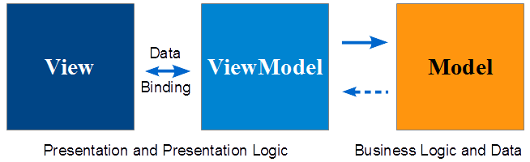

#  Coffee Pot 

Coffee PotはJavaScript用MVVMフレームワークです。

以下の特徴を持ちます。

* Viewの値をバインドしてViewModelに保持します
* バインドする値を整形して型変換します
* Viewの入力値をフォーマットして再表示します


## インストール

```
$ git clone git://github.com/keisuken/coffeepot.git
```

## 必要なライブラリ

jQueryが必要です。レポジトリの中に含まれています。


## MVVMパターン

MVVMはView, ViewModel, Modelの3つにわかれ、それぞれ見た目、見た目に対する操作、ビジネスロジックを担当します。



名前      | 詳細
----------|----------------------------
View      | プレゼンテーション(HTML(DOM))
ViewModel | プレゼンテーションロジック(イベント処理とデータ)
Model     | ビジネスロジックとデータ


## View

Viewは見た目を担当し、HTMLとして記述されます。

DOM(HTMLのタグ)に一意のid属性を付けることによってViewModelにバインドできるようになり操作できます。

```
<!-- Form -->
<div>
  <input id="name" type="text">
  <input id="mail" type="text">
  <select id="sex">
    <option value="1">Male</option>
    <option value="2">Female</option>
    <option value="0">Unkown</option>
  </select>
  <input id="age" type="text">
</div>

<!-- Preview table -->
<div>
  <table>
    <thead>
      <tr>
        <td>Name</td>
        <td>Mail</td>
        <td>Sex</td>
        <td>Age</td>
      </tr>
    </thead>
    <tbody>
      <tr>
        <td id="preview_name"></td>
        <td id="preview_mail"></td>
        <td id="preview_sex"></td>
        <td id="preview_age"></td>
      </tr>
    </tbody>
  </table>
</div>
```


## ViewModel

ViewModelはViewのプレゼンテーションロジックを担当し、入力値などのViewの値をバインドします。

val属性を指定した場合は自動的にViewModelのvaluesに保持されます。

Viewにはバリデーションやフォーマットなどのアクションを設定でき、必要に応じてViewの値をフォーマットして再表示したり、型変換を行ってViewModelのvaluesに格納されます。

```
bindings: {
  // <input id="value0" type="text" values="">
  value0: ['val', function(value) {this.updateResult();}],
  // 
  image0$src: 'attr',
  // <span id="message"></span>
  message: 'text',
  // <div id="urlList"></div>
  urlList: 'html',
},
events: {
  submit: {
    click: function(event) {
      ...
      this.Model.submit(value0, value1, ...);
    }
  }
}
```


## Model

Modelは見た目に関係ないビジネスロジックを担当し、ViewModelから呼び出され、サーバを呼び出したり、場合によってはViewModelを呼び出したりしながら、アプリケーションの目的を果たします。


## Appendix


### コード例

```
$(document).ready(function() {

  // ViewModel
  var ViewModel = {

    // Initialize

    init: function() {
      // 初期化コード
    },

    // バインド

    bindings: [
      url: 'val',
      title: 'val',
      tags: 'val'
    ],

    events: {
      url: {
        'change': function(event) {
          this.Model.getTitle(this.$.url);
        }
      }),
      submit: {
        click: function(event) {
          var _ = this.values;
          this.Model.submit(_.url, _.title, _.tags);
        }
      }
    },

    // Update title.
    updateTitle: function(title) {
      this.set('title', title);
    }

  };

  // Model
  var Model = {

    // Get web page title.
    getTitle: function(url) {
      ...
    },

    // Submit form.
    submit: function(url, title, tags) {
      ...
    }
  };

  CoffeePot.set(VideModel, Model);

});

...

<input id="url" type="text" value="">
<input id="title" type="text" value="">
<input id="tags" type="text" value="">
<input id="submit" type="submit" value="Submit">

...
```


## API


### メソッド


#### ViewModel

名称   | 内容
-------|-------------------------------
init   | 初期化する
bind   | データおよびイベントを設定する
unbind | データおよびイベントを解除する


#### Model

名称   | 内容
-------|-------------------------------
init   | 初期化する


### プロパティ


#### ViewModel

名称     | 内容
---------|-------------------
bindings | データバインド情報
events   | イベント情報
values   | データプロパティ


### イベント

名称      | 内容
----------|----------------------
blur      | フォーカスが外れた
focus     | フォーカスされた
change    | 入力内容が変更された
click     | クリックされた
dblClick  | ダブルクリックされた
keuUp     | キーを離した
keyDown   | キーを押した
keyPress  | キーを打った
mouseUp   | マウスボタンを押した
mouseDown | マウスボタンを離した
mouseMove | マウスが移動した
mouseOut  | 領域からマウスが外れた
mouseOver | 領域にマウスが入った
mouseMove | マウスを動かした


### バインド

ViewModelのデータバインドの定義です。

1. DOM種類
2. 型(Converter)
3. 整形(Reducer)
4. フォーマッタ(Formatter)

```
bindings: {
  name: 'val:text:trim,default(),max(100):',
  amount: 'val:int:trim:comma3'
}
```


#### DOM種類

属性     | 詳細
---------|-----------
val      | FORMの入力
attr     | 属性
class    | クラス
text     | テキスト
html     | HTML


#### 型(Converter)

型       | 内容
---------|-------------------
text     | テキスト
int      | 整数
float    | 浮動小数点
boolean  | 論理
date     | 日付(未実装)


#### 整形(Reducer)

型         | 内容
-----------|-------------------
trim       | 前後のスペース削除
default    | 空の場合のデフォルト値
max        | 最大文字数
replace    | 正規表現文字置換


#### フォーマッタ(Formatter)

型       | 内容
---------|-------------------
comma3   | 3カンマ区切り
comma4   | 4カンマ区切り
date     | 日付
format   | sprintf相当


#### 例

```
binds: {
  name: 'val:int:trim,max(100):comma3',
  amount: 'val:int:trim:comma3',
  ...
}
```
